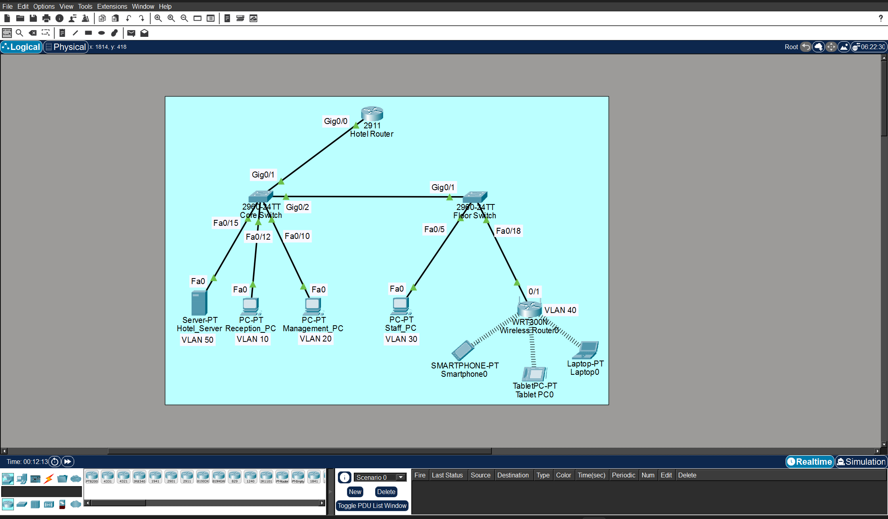
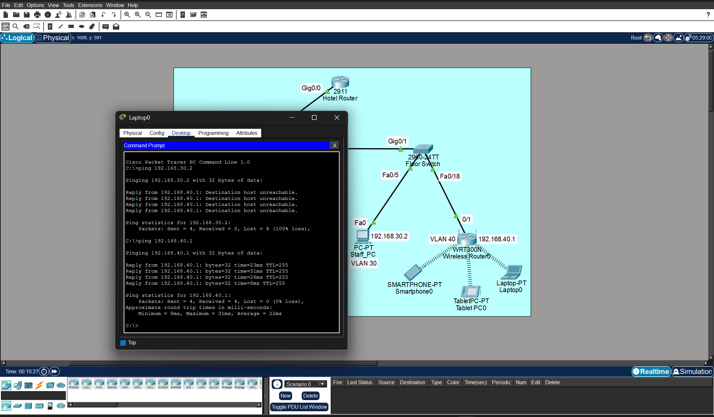
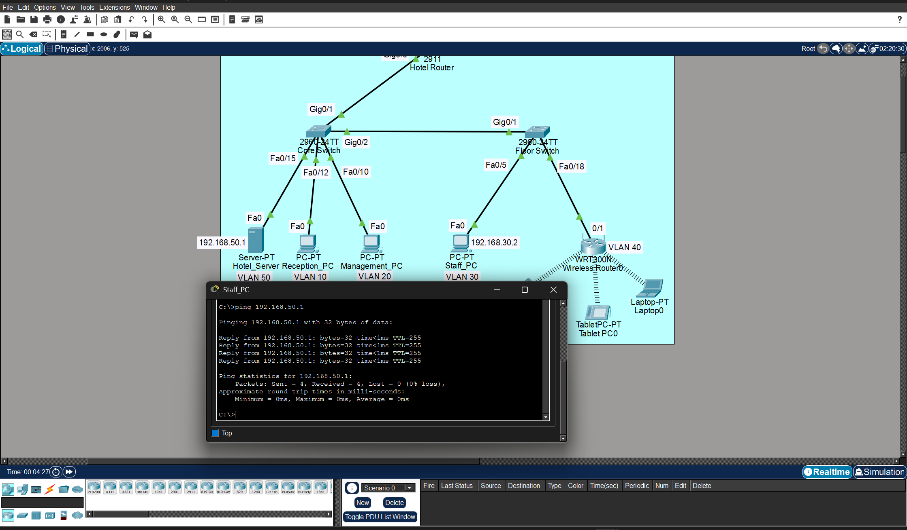
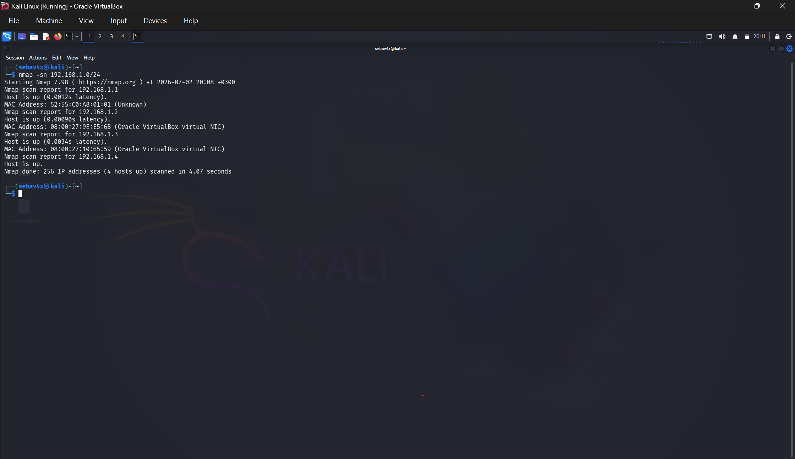
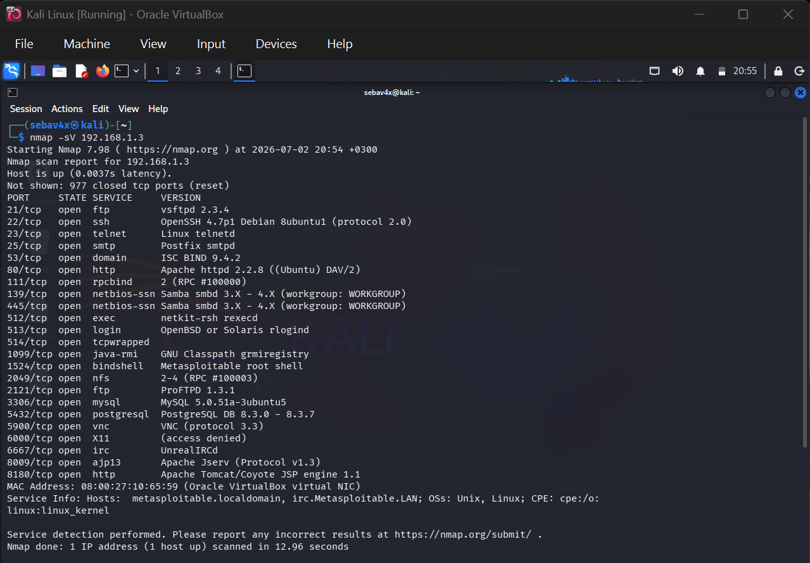
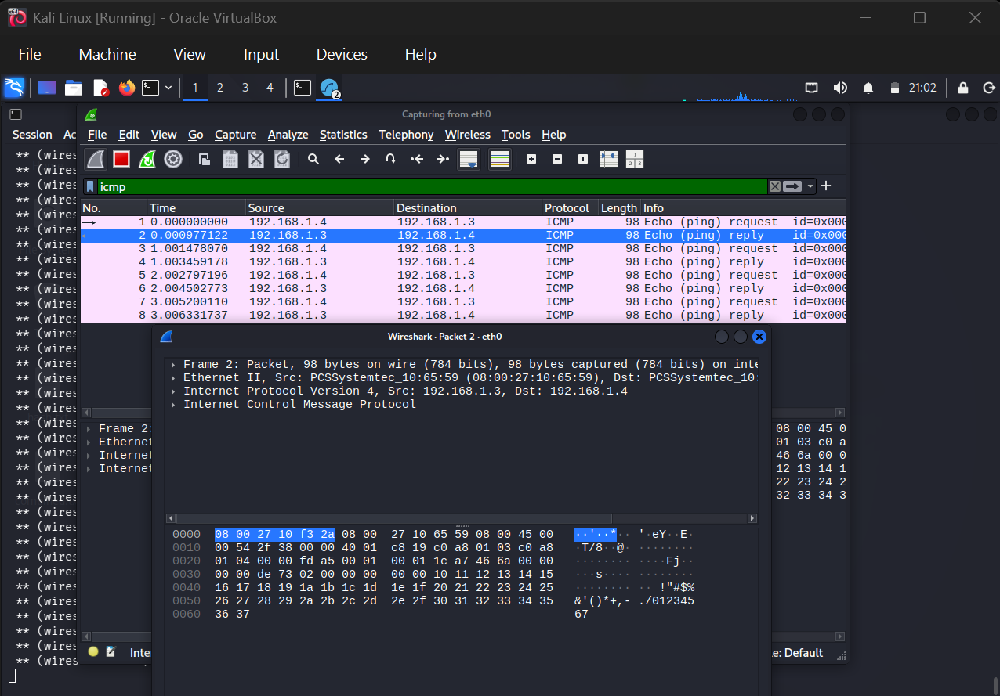
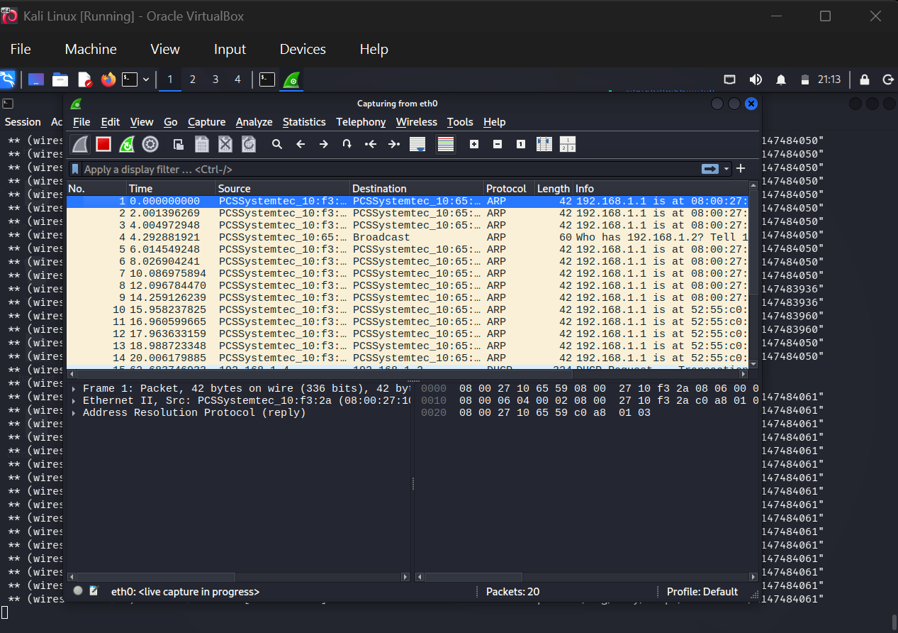

# Secure Hotel Enterprise Network
### Blue Team Defense with Red Team Reconnaissance

A hands-on enterprise networking and cybersecurity project built using Cisco Packet Tracer and complemented by a separate Kali Linux reconnaissance lab.

The project demonstrates how defensive network engineering (Blue Team) and attacker reconnaissance (Red Team) complement each other in securing an enterprise environment.

---

# Project Overview

The objective of this project was to simulate a secure hotel enterprise network by implementing network segmentation, secure communication, and Layer 2 security features while documenting the entire implementation professionally.

---

# Key Features

- Enterprise Hotel Network Design
- VLAN Segmentation
- Router-on-a-Stick
- Extended ACL Implementation
- DHCP Snooping
- Port Security
- Network Security Validation
- Nmap Reconnaissance
- Wireshark Traffic Analysis
- Professional Project Documentation
  
---
# 🔵🔴 Blue Team vs Red Team Workflow

This project was completed in three phases to simulate how enterprise networks are built, assessed, and validated.

## 🔵 Phase 1 – Blue Team: Build & Secure

Designed and implemented a secure hotel enterprise network in Cisco Packet Tracer.

Security controls included:

- VLAN Segmentation
- Inter-VLAN Routing (Router-on-a-Stick)
- Extended ACLs
- DHCP Snooping
- Port Security

---

## 🔴 Phase 2 – Red Team: Reconnaissance

A separate Kali Linux lab was used to simulate the reconnaissance phase of an attacker.

Activities performed:

- Host Discovery using Nmap
- Service Enumeration
- Network Traffic Analysis using Wireshark

> Note: The Kali Linux lab was intentionally kept separate from the Packet Tracer environment. It was used to understand attacker reconnaissance techniques rather than directly attack the simulated enterprise network.

---

## 🔵 Phase 3 – Blue Team: Validation

After implementing the security controls, the network was validated by confirming that:

- Guest Wi-Fi traffic was restricted by ACLs.
- DHCP Snooping was functioning correctly.
- Port Security protected switch access ports.
- Authorized users maintained normal network connectivity.

This workflow demonstrates how defensive network security and attacker reconnaissance complement each other in a practical learning environment.

---
## Network Topology

The topology includes:

- Hotel Router
- Core Switch
- Floor Switch
- Hotel Server
- Management Network
- Reception Network
- Staff Network
- Guest Wi-Fi Network

---

# VLAN Architecture

| VLAN | Department |
|-------|------------|
| 10 | Management |
| 20 | Reception |
| 30 | Staff |
| 40 | Guest Wi-Fi |
| 50 | Servers |

---

# Implemented Security Features

### VLAN Segmentation

Separated departments into isolated VLANs to improve security and reduce unnecessary broadcast traffic.

---

### Access Control Lists (ACL)

Implemented Extended ACLs to restrict Guest Wi-Fi users from accessing internal enterprise resources while allowing legitimate traffic.

---

### DHCP Snooping

Configured DHCP Snooping to protect the network against rogue DHCP servers.

---

### Port Security

Implemented Port Security on access ports to restrict unauthorized devices.

---

# Validation

The implemented security controls were successfully validated.

Validation included:

- ACL blocking unauthorized access
- DHCP Snooping verification
- Port Security verification
- Network connectivity testing

### ACL Validation

### Network Connectivity

---

# Kali Linux Lab

A separate Kali Linux lab was used to practice fundamental cybersecurity techniques including:

- Host Discovery
- Service Enumeration
- Packet Analysis using Wireshark

The purpose of the lab was to strengthen practical cybersecurity skills alongside the Cisco networking project.

### Nmap Host Discovery

### Service Enumeration

---
# Wireshark Analysis

Wireshark was used to observe and analyze network traffic during the lab exercises.

### ICMP Traffic

### ARP Observation

## Repository Structure

This repository is organized into the following directories:

- docs/ – Project documentation and design notes.
- packet-tracer/ – Cisco Packet Tracer project files.
- kali-lab/ – Documentation of the Kali Linux reconnaissance exercises.
- screenshots/topology/ – Network topology diagram.
- screenshots/packet-tracer/ – Cisco configuration screenshots.
- screenshots/validation/ – Validation and testing screenshots.
- screenshots/wireshark/ – Wireshark traffic analysis.
- screenshots/kali/ – Nmap reconnaissance screenshots.

# Technologies Used

### Networking

- Cisco Packet Tracer
- Cisco IOS
- VLANs
- Router-on-a-Stick
- DHCP

### Security

- Access Control Lists (ACL)
- DHCP Snooping
- Port Security

### Cybersecurity

- Kali Linux
- Nmap
- Wireshark

---

# Skills Demonstrated

- Enterprise Network Design
- Network Segmentation
- Cisco Switching
- Cisco Routing
- VLAN Configuration
- ACL Configuration
- DHCP Snooping
- Port Security
- Network Validation
- Basic Network Reconnaissance
- Packet Analysis
- Technical Documentation

---
# What I Learned

Through this project I gained practical experience in:

- Designing segmented enterprise networks
- Implementing Cisco Layer 2 security features
- Configuring and validating ACLs
- Understanding reconnaissance techniques used by attackers
- Analyzing network traffic with Wireshark
- Documenting technical projects using GitHub

This project strengthened both my networking and cybersecurity fundamentals while improving my technical documentation skills.

# Future Improvements

Future versions of this project may include:

- Dynamic ARP Inspection (DAI)
- Active Directory Integration
- pfSense Firewall
- IDS / IPS
- SIEM Integration
- Vulnerability Assessment Lab

---

# Author

This project was developed as part of my personal networking and cybersecurity learning journey and is included in my professional portfolio.
